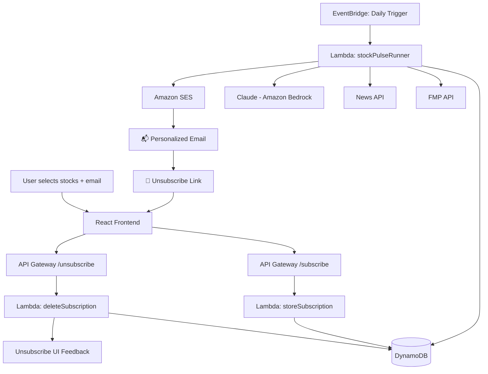

# 🤖 Build a Fully Serverless AI Agent on AWS Using Amazon Bedrock

You’ve probably heard about **Amazon Bedrock** by now. AWS’s fully managed service gives you easy access to state-of-the-art foundation models like Claude, Titan, and Jurassic — without ever touching GPUs, infrastructure, or container hosting.

In this project, we’ll show you how to use Bedrock not just to generate text, but to build a **real AI agent**: one that collects live stock data, analyzes financial news, reasons over that data using Claude, and emails daily personalized insights to users — entirely autonomously.

We’ll build everything using **fully serverless AWS services**:
- S3 and CloudFront for hosting
- API Gateway + Lambda for backend logic
- DynamoDB for user preferences
- EventBridge for daily automation
- SES for email delivery
- Bedrock for LLM-powered reasoning

The result? A production-grade AI agent that’s cost-efficient, scalable, and simple to manage — no EC2, no servers, no infrastructure headaches.

---

## 📦 StockPulse AI Agent (MVP)

StockPulse is a **fully serverless AI-powered stock research agent**. It uses Amazon Bedrock to generate AI insights, allows users to subscribe to their favorite stocks, and emails them daily AI-generated summaries using Claude.

This guide walks you through **end-to-end setup using AWS Console only**, explaining all critical configurations and common gotchas so you can deploy confidently.

> 🧪 Everything you build here is serverless, automated, and event-driven — no backend infrastructure to manage.

---

## ✅ What You’ll Build

- A modern React frontend (hosted via **S3 + CloudFront**)
- Email + stock preferences stored in **DynamoDB**
- API Gateway triggers two Lambdas for subscribe/unsubscribe
- Daily analysis powered by **Claude (Amazon Bedrock)**
- **Emails sent via Amazon SES**
- A fully working unsubscribe flow
- No backend servers required

---

## 🧰 Tech Stack

| Component     | Tech                          |
|--------------|-------------------------------|
| Frontend      | React (S3 + CloudFront)        |
| Backend       | AWS Lambda (Python)            |
| APIs          | API Gateway (HTTP API)         |
| Data Store    | DynamoDB                       |
| Email         | Amazon SES                     |
| AI Model      | Claude (via Amazon Bedrock)    |
| Scheduler     | Amazon EventBridge             |

---


## 🧱 Architecture Diagram



---

## 🧑‍💻 React Frontend Setup

### 1. Build the React App

```bash
cd frontend
npm install
npm run build
```

This generates a production-ready build in the `build/` directory.

---

## 🪣 Deploy Frontend on S3

### 1. Create S3 Bucket

- Go to AWS Console → **S3**
- Click **Create bucket**
- Give it a unique name (e.g., `stockpulse-ui`)
- Uncheck **Block all public access**
- Click **Create bucket**

### 2. Enable Static Website Hosting

- Click your new bucket → **Properties**
- Scroll to **Static website hosting**
- Click **Edit**
- Enable hosting
- Set:
  - **Index document**: `index.html`
  - **Error document**: `index.html`
- Click **Save changes**

### 3. Upload React Build

- Go to the bucket → **Objects**
- Click **Upload**
- Upload **contents of `build/`**, NOT the `build/` folder itself
- Click **Upload**

### 4. Make Bucket Public

Go to **Permissions → Bucket policy**, paste:

```json
{
  "Version": "2012-10-17",
  "Statement": [{
    "Effect": "Allow",
    "Principal": "*",
    "Action": "s3:GetObject",
    "Resource": "arn:aws:s3:::stockpulse-ui/*"
  }]
}
```

Replace `stockpulse-ui` with your bucket name.

---

## 🌍 Set Up CloudFront

### 1. Create Distribution

- Go to **CloudFront → Create distribution**
- Origin domain → Manually type in the **S3 static website endpoint** (e.g., `stockpulse-ui.s3-website-us-east-1.amazonaws.com`)
  > 💡 *Do not select from dropdown. That adds S3 as origin, not the static website endpoint.*

- Set **Default root object** = `index.html`
- Leave everything else default
- Click **Create distribution**

### 2. Test

Open the CloudFront domain (e.g., `https://d1234.cloudfront.net`)  
You should see the app load.

---

## 🛣️ API Gateway Setup (Subscribe & Unsubscribe)

### 1. Go to **API Gateway → Create API → HTTP API**

- Name: `StockPulse API`
- Select **Add routes manually**
- Add 2 routes:
  - `POST /subscribe`
  - `GET /unsubscribe`

### 2. Create 2 Lambda Functions

In **AWS Console → Lambda**:

- `storeSubscription` (POST handler)
- `unsubscribeUser` (GET handler)

Use code from the repo: `lambdas/storeSubscription.py`, `unsubscribeUser.py`

### 3. Attach Lambdas to API

- In API Gateway, click each route
- Click **Attach integration**
- Choose Lambda → Select appropriate function
- Click **Deploy**

---

## 🌐 CORS Configuration (Manually via Lambda)

HTTP APIs don’t show CORS options in the console. You must handle it inside your Lambda.

In both Lambdas, include this block:

```python
if event.get("requestContext", {}).get("http", {}).get("method") == "OPTIONS":
    return {
        'statusCode': 200,
        'headers': {
            'Access-Control-Allow-Origin': '*',
            'Access-Control-Allow-Methods': 'POST, OPTIONS, GET',
            'Access-Control-Allow-Headers': 'Content-Type'
        },
        'body': ''
    }
```

Also, add `Access-Control-Allow-Origin: *` to **all responses**.

---

## 🧾 DynamoDB Setup

1. Go to **DynamoDB → Create table**
2. Name: `StockPulseSubscriptions`
3. Partition key: `email` (type: String)
4. Capacity mode: **On-demand**
5. Click **Create**

---

## 📬 Amazon SES Setup

1. Go to **SES → Verified Identities**
2. Click **Create identity**
3. Select **Email address** (e.g., `yourname@domain.com`)
4. Follow email verification
5. If still in sandbox:
   - You can only send to verified addresses
   - Go to SES → **Account Dashboard** → Click **Request Production Access**

---

## 🧠 Amazon Bedrock Setup

1. Open **Amazon Bedrock Console**
2. Go to **Model access**
3. Ensure `Claude (Anthropic)` is enabled
4. In your Lambda (`stockPulseRunner`), call it using:

```python
import boto3
bedrock = boto3.client("bedrock-runtime", region_name="us-east-1")
```

Use `invoke_model(...)` to call Claude

---

## ⏰ EventBridge Scheduler

1. Go to **EventBridge → Rules → Create rule**
2. Name it `DailyStockPulseRunner`
3. Rule type: **Schedule**
4. Cron expression for 8AM EST:
```
cron(0 13 * * ? *)
```
5. Add target: Lambda → `stockPulseRunner`
6. Click **Create rule**

---

## 🔐 IAM Role Permissions

### storeSubscription

```json
{
  "Effect": "Allow",
  "Action": ["dynamodb:PutItem"],
  "Resource": "arn:aws:dynamodb:us-east-1:<account-id>:table/StockPulseSubscriptions"
}
```

### unsubscribeUser

```json
{
  "Effect": "Allow",
  "Action": ["dynamodb:DeleteItem"],
  "Resource": "arn:aws:dynamodb:us-east-1:<account-id>:table/StockPulseSubscriptions"
}
```

### stockPulseRunner

```json
{
  "Effect": "Allow",
  "Action": [
    "dynamodb:Scan",
    "bedrock:InvokeModel",
    "ses:SendEmail"
  ],
  "Resource": "*"
}
```

---

## 🧪 API Testing

### Subscribe
```bash
curl -X POST https://<api-id>.execute-api.us-east-1.amazonaws.com/subscribe \
-H "Content-Type: application/json" \
-d '{"email": "user@example.com", "symbols": ["TSLA", "AAPL"]}'
```

### Unsubscribe
```bash
curl "https://<api-id>.execute-api.us-east-1.amazonaws.com/unsubscribe?email=user@example.com"
```

---

## 🧠 Common Gotchas

| Problem                             | Fix/Explanation |
|-------------------------------------|-----------------|
| CloudFront shows XML error          | You used S3 origin instead of website hosting URL |
| React app doesn’t load              | You uploaded the `build/` folder instead of its **contents** |
| CORS errors in frontend             | You didn’t handle OPTIONS requests in Lambda |
| Bedrock returns access denied       | IAM role lacks `bedrock:InvokeModel` permission or model isn’t enabled |
| SES fails to send                   | Still in sandbox — verify recipient or request production access |

---

## ✅ Final Deployment Checklist

- [x] React frontend deployed on S3 + CloudFront
- [x] Backend APIs created via Lambda + API Gateway
- [x] CORS handled inside Lambda
- [x] DynamoDB table created
- [x] Claude model access confirmed
- [x] EventBridge schedule configured
- [x] SES verified sender used
- [x] Unsubscribe fully working

---

## 📌 GitHub Repo

➡️ [https://github.com/yeluru/stockpulse-ai-agent](https://github.com/yeluru/stockpulse-ai-agent)
