# 🚀 Build a Serverless AI Agent Using AWS resources including Bedrock— End to End

You’ve probably heard about Amazon Bedrock by now. AWS’s new fully managed service lets you tap into powerful foundation models like Claude, Titan, and Jurassic — without managing GPUs, infrastructure, or model hosting. 

If you’ve been curious about Amazon Bedrock, this project is for you. We’re going to build a real AI agent — not a chatbot, but an automated reasoning system that pulls live stock data, analyzes news headlines, generates daily recommendations using Claude, and delivers personalized insights to users via email. And we’ll do it entirely serverless: no backend servers, no EC2, no provisioning — just S3, Lambda, API Gateway, DynamoDB, EventBridge, and SES working together. Bedrock lets us tap into cutting-edge LLMs with zero infrastructure, and serverless architecture ensures we only pay for what we use. The result? A production-grade AI agent that runs daily, scales on demand, and is cheap, elegant, and surprisingly easy to deploy. By the end, you’ll understand how to wire Bedrock into a full-stack system, build a clean user experience, and ship something you’d be proud to show your future self.

## 📈 StockPulse AI Agent (MVP)

StockPulse is a **fully serverless AI-powered stock research agent**. It uses Amazon Bedrock to generate AI insights, allows users to subscribe to their favorite stocks, and emails them daily AI-generated summaries using Claude.

This guide walks you through **end-to-end setup using AWS Console only**, explaining all critical configurations and common gotchas so you can deploy confidently.

---

## 🚀 What You’ll Build

- A modern React frontend (hosted via **S3 + CloudFront**)
- Email + stock preferences stored in **DynamoDB**
- API Gateway triggers two Lambdas for subscribe/unsubscribe
- Daily analysis powered by **Claude (Amazon Bedrock)**
- **Emails sent via Amazon SES**
- A fully working unsubscribe flow
- No backend servers required

---

## 🧰 Tech Stack

| Component     | Tech                          |
|--------------|-------------------------------|
| Frontend      | React (S3 + CloudFront)        |
| Backend       | AWS Lambda (Python)            |
| APIs          | API Gateway (HTTP API)         |
| Data Store    | DynamoDB                       |
| Email         | Amazon SES                     |
| AI Model      | Claude (via Amazon Bedrock)    |
| Scheduler     | Amazon EventBridge             |

---

## 🧱 Architecture Diagram

```mermaid
graph TD
  User[User selects stocks + email]
  Frontend[React Frontend]
  APISubscribe[API Gateway /subscribe]
  LambdaStore[Lambda: storeSubscription]
  DynamoDB[(DynamoDB)]
  
  EventBridge[EventBridge: Daily Trigger]
  LambdaDaily[Lambda: stockPulseRunner]
  FMPAPI[FMP API]
  NewsAPI[News API]
  Bedrock[Claude - Amazon Bedrock]
  SES[Amazon SES]
  Email[📬 Personalized Email]
  
  UnsubscribeLink[🔗 Unsubscribe Link]
  APIUnsubscribe[API Gateway /unsubscribe]
  LambdaUnsub[Lambda: deleteSubscription]
  UnsubUI[Unsubscribe UI Feedback]

  %% Subscription Flow
  User --> Frontend
  Frontend --> APISubscribe
  APISubscribe --> LambdaStore
  LambdaStore --> DynamoDB

  %% Daily Processing
  EventBridge --> LambdaDaily
  LambdaDaily --> DynamoDB
  LambdaDaily --> FMPAPI
  LambdaDaily --> NewsAPI
  LambdaDaily --> Bedrock
  LambdaDaily --> SES
  SES --> Email

  %% Unsubscribe Flow
  Email --> UnsubscribeLink
  UnsubscribeLink --> Frontend
  Frontend --> APIUnsubscribe
  APIUnsubscribe --> LambdaUnsub
  LambdaUnsub --> DynamoDB
  LambdaUnsub --> UnsubUI
```



---

## 🛠️ Frontend Deployment (S3 + CloudFront)

### 1. Build React App

```bash
cd frontend
npm install
npm run build
```

### 2. Create S3 Bucket

1. Go to **AWS Console → S3 → Create bucket**
2. Uncheck “Block all public access”
3. Name it `stockpulse-ui` or similar
4. Region: e.g., `us-east-1`
5. Click **Create**

### 3. Enable Static Website Hosting

1. Open the bucket → **Properties**
2. Scroll to **Static website hosting**
3. Enable it
4. Set:
   - Index document: `index.html`
   - Error document: `index.html`
5. Save

### 4. Make Public

Go to **Permissions → Bucket policy**, and paste:

```json
{
  "Version": "2012-10-17",
  "Statement": [{
    "Effect": "Allow",
    "Principal": "*",
    "Action": "s3:GetObject",
    "Resource": "arn:aws:s3:::your-bucket-name/*"
  }]
}
```

### 5. Upload Files

Upload the **contents of `build/`**, not the folder itself.

### 6. Create CloudFront Distribution

1. Go to **CloudFront → Create distribution**
2. Origin domain = your **S3 website endpoint** (e.g., `s3-website-us-east-1.amazonaws.com`)
   > 💡 *Don’t choose the default S3 origin suggestion — it won’t work for static sites.*
3. Default root object: `index.html`
4. Click **Create Distribution**

### 7. Test

Use the CloudFront domain (e.g. `https://d1234abc.cloudfront.net`) to load your app.

Update unsubscribe links to use this domain in `App.js`.

---

## 🌐 API Gateway + Lambda (Subscribe & Unsubscribe)

### 1. Create HTTP API

Go to **API Gateway → Create API → HTTP API**

- Add two routes:
  - `POST /subscribe`
  - `GET /unsubscribe`

### 2. Connect Lambdas

For each route:
- Click the route
- Choose **Attach integration**
- Select the Lambda (`storeSubscription` or `unsubscribeUser`)
- Confirm and deploy

### 3. Enable CORS (Manually via Lambda)

> 💡 *CORS does NOT show in API Gateway console for HTTP APIs. It must be handled inside your Lambda.*

Inside your Lambda, check for OPTIONS and return CORS headers:

```python
if event['requestContext']['http']['method'] == 'OPTIONS':
    return {
        'statusCode': 200,
        'headers': {
            'Access-Control-Allow-Origin': '*',
            'Access-Control-Allow-Methods': 'POST, OPTIONS',
            'Access-Control-Allow-Headers': 'Content-Type'
        },
        'body': ''
    }
```

Add same headers to all `200 OK` responses too.

---

## 🗃️ DynamoDB Configuration

1. Go to **DynamoDB → Create Table**
2. Table name: `StockPulseSubscriptions`
3. Partition key: `email` (type: String)
4. Choose **On-Demand capacity**
5. Click **Create table**

---

## 📩 Amazon SES Setup

1. Go to **Amazon SES → Verified identities**
2. Click **Create identity → Email address**
3. Add your sender email (e.g., `yourname@domain.com`)
4. Confirm verification email

💡 SES starts in **sandbox mode**:
- You can only send emails to verified recipients.
- Request **production access** to remove this limitation.

---

## 🧠 Amazon Bedrock Setup

1. Go to **Amazon Bedrock Console**
2. Under **Model Access**, ensure `Claude` is enabled
3. In your Lambda, use:

```python
import boto3
bedrock = boto3.client("bedrock-runtime", region_name="us-east-1")
```

---

## ⏰ EventBridge (Schedule Daily Job)

1. Go to **Amazon EventBridge → Rules → Create rule**
2. Name it `DailyStockPulse`
3. Choose **Schedule → cron expression**

Example (8am EST):
```
cron(0 13 * * ? *)
```

4. Target → Lambda → `stockPulseRunner`
5. Click **Create**

---

## 🔐 IAM Permissions (Lambdas)

### storeSubscription

```json
{
  "Effect": "Allow",
  "Action": ["dynamodb:PutItem"],
  "Resource": "arn:aws:dynamodb:us-east-1:<account-id>:table/StockPulseSubscriptions"
}
```

### unsubscribeUser

```json
{
  "Effect": "Allow",
  "Action": ["dynamodb:DeleteItem"],
  "Resource": "arn:aws:dynamodb:us-east-1:<account-id>:table/StockPulseSubscriptions"
}
```

### stockPulseRunner

```json
{
  "Effect": "Allow",
  "Action": [
    "dynamodb:Scan",
    "bedrock:InvokeModel",
    "ses:SendEmail"
  ],
  "Resource": "*"
}
```

---

## 🧪 Testing

### Subscribe
```bash
curl -X POST https://<api-id>.execute-api.us-east-1.amazonaws.com/subscribe \
-H "Content-Type: application/json" \
-d '{"email": "test@example.com", "symbols": ["TSLA", "GOOG"]}'
```

### Unsubscribe
```bash
curl "https://<api-id>.execute-api.us-east-1.amazonaws.com/unsubscribe?email=test@example.com"
```

---

## 🧠 Common Gotchas

- **CORS not working?**  
  You must handle OPTIONS requests in Lambda; there's no visual CORS config in HTTP API.

- **CloudFront returns XML error?**  
  You selected the wrong S3 origin. Use the **website hosting endpoint**.

- **App loads blank screen?**  
  Check if you uploaded the entire `build/` folder or just its contents.

- **Email not sent?**  
  SES is in sandbox mode. Only verified emails can be recipients.

- **Unsubscribe link not working?**  
  Ensure you deployed the unsubscribe Lambda and URL matches CloudFront.

- **Bedrock returns access denied?**  
  Check IAM role has `bedrock:InvokeModel` and model is enabled under access.

---

## ✅ Final Deployment Checklist

- [x] React frontend deployed via S3 + CloudFront
- [x] Subscribe + Unsubscribe endpoints deployed
- [x] Lambdas connected to API Gateway
- [x] CORS handled inside Lambda
- [x] DynamoDB table created
- [x] Daily trigger scheduled via EventBridge
- [x] Claude model access confirmed
- [x] Emails sent via verified SES sender
- [x] Unsubscribe deletes record from DynamoDB

---

## 📌 GitHub Repo

➡️ https://github.com/yeluru/stockpulse-ai-agent
